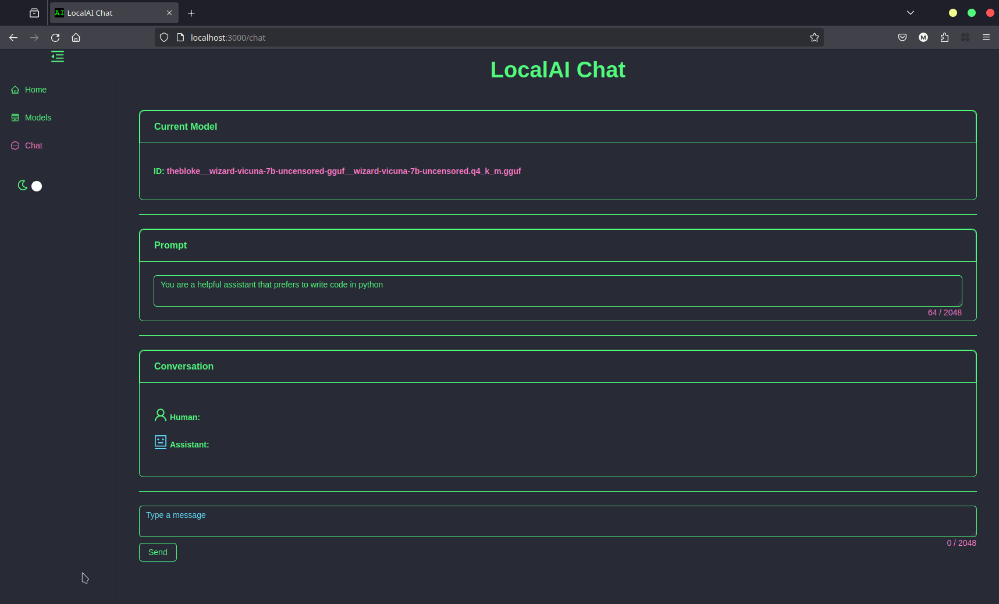
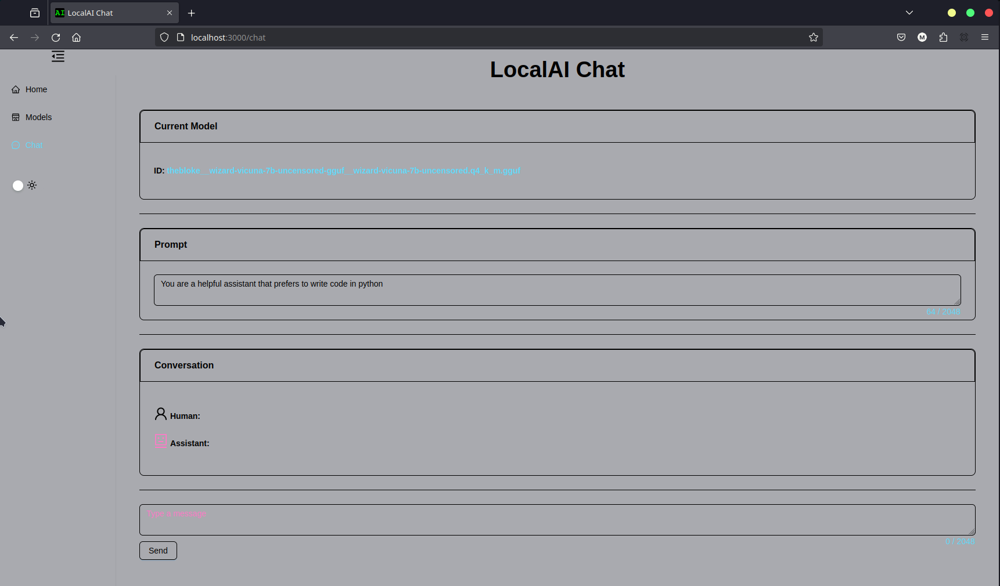
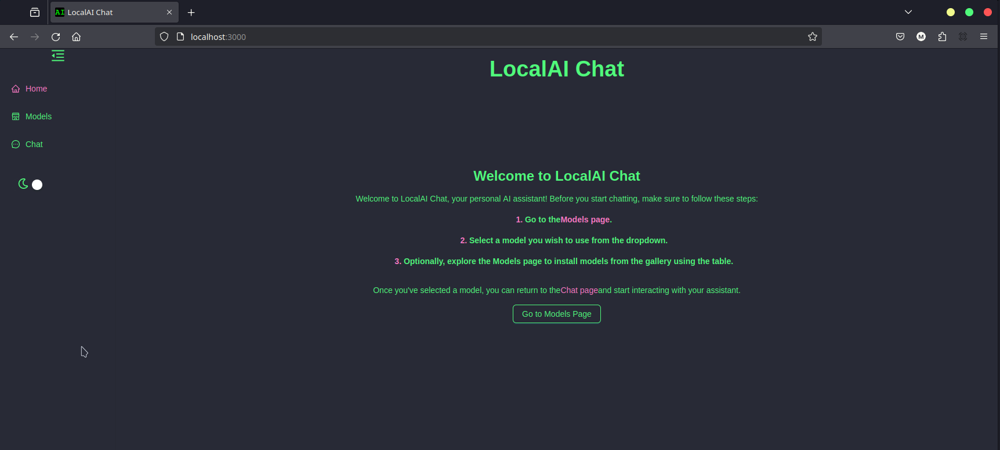
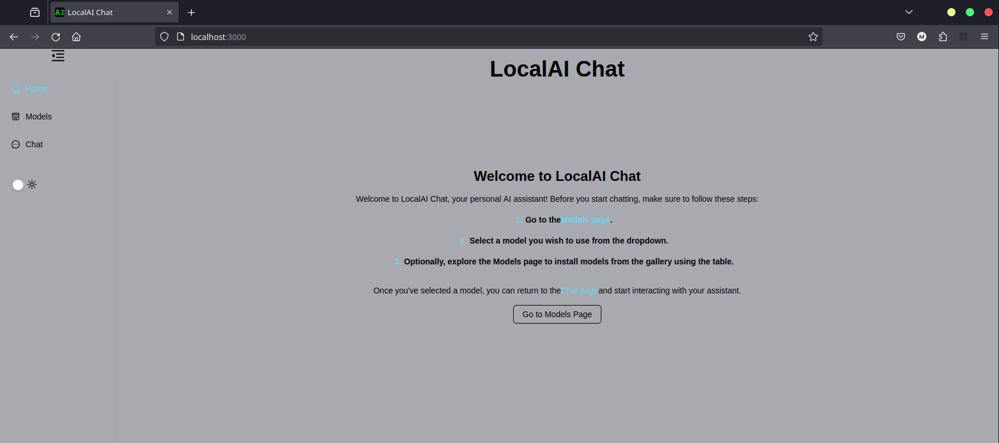
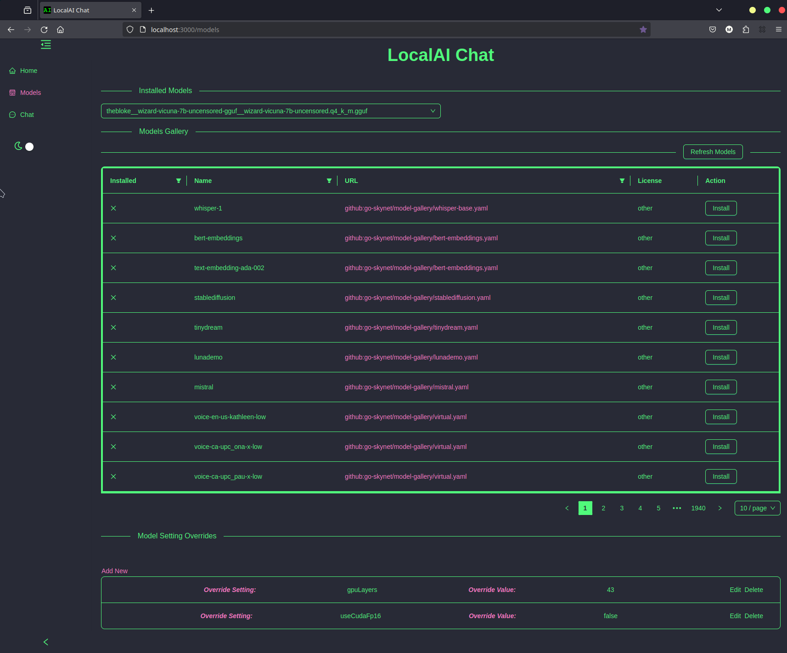
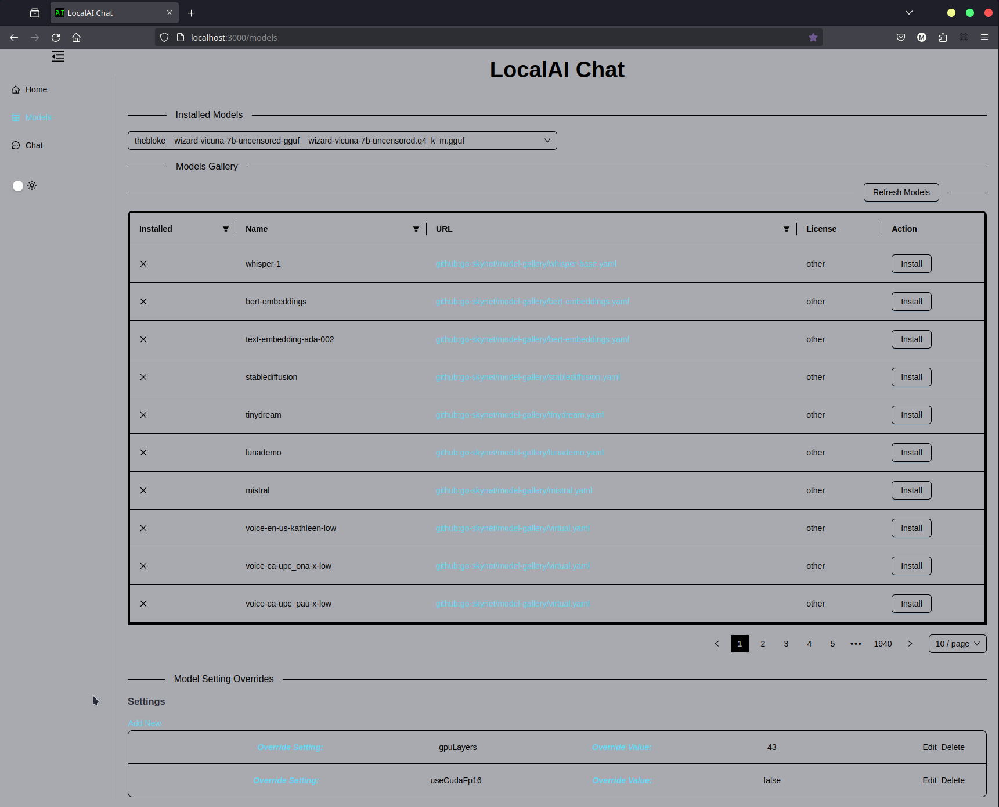

# LocalAI Chat

## Overview

LocalAI Chat is a React application designed to manage models and facilitate conversations with a chatbot. It provides features for installing models, managing settings overrides, and conducting conversations with an AI assistant.

## Features

- **Model Management**: View installed models, install new models, and refresh the list of available models.
- **Settings Overrides**: Customize model settings by overriding default configurations.
- **Chat Interface**: Conduct conversations with an AI assistant using customizable prompts and view the responses.

## Screenshots

### Chat Interface

**Dark Theme**



**Light Theme**



### Home Page

**Dark Theme**



**Light Theme**



### Models Page

**Dark Theme**



**Light Theme**




## Manual Installation

1. Clone the repository:

   ```bash
   git clone https://github.com/1mckenna/localai-chat.git
   ```

2. Install dependencies:

   ```bash
   cd localai-chat
   npm install
   ```

3. Set up environment variables:
   
   - Create a `.env` file in the root directory.
   - Define the following environment variables:

      ```dotenv
      REACT_APP_SERVER_URL=<server-url>
      ```

   Replace `<server-url>` with the URL of your backend server.

4. Start the development server:

   ```bash
   npm start
   ```

## Docker/Podman Compose

```
docker-compose up -d --build
```


## Usage

### Model Management

- Select a model from the dropdown menu to view details and install it.
- Use the "Refresh Models" button to update the list of available models.

### Settings Overrides

- Navigate to the "Model Setting Overrides" section to customize model settings.
- Add, edit, or remove overrides and save them for future use.

### Chat Interface

- Use the textarea to input prompts for the AI assistant.
- Click the "Send" button to send the prompt and view the response.
